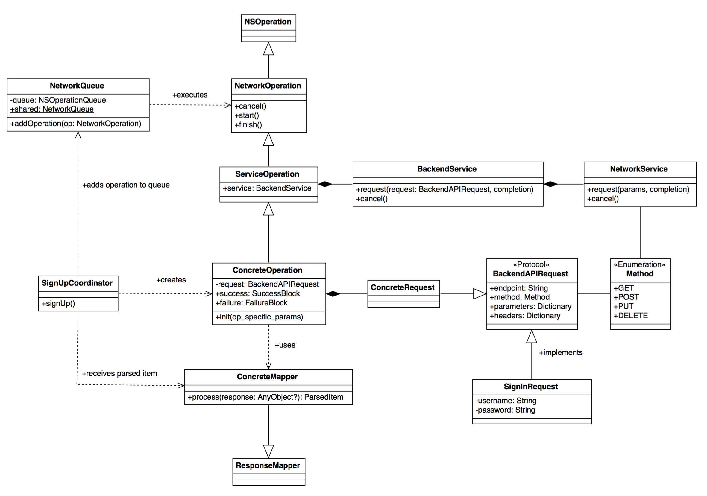

# NetworkLayerExample

<center> <h1>🚧 Work In Progress 🚧</h1> </center>

Improved version of the Network Layer solution by [Tomasz Szulc](https://github.com/tomkowz) presented in the article: http://szulctomasz.com/how-do-I-build-a-network-layer/

The idea is to create a modular network layer, 100% testable, that implements `NSOperation` to manage easily a requests queue, with priority, dependecy, cancel operation etc.

## Architecture


- ### Request

A `struct` that implement `BackendAPIRequest` protocol. It's an object that knows which endpoint to hit, what method to use, should it be GET, POST, PUT or different, how to configure the body of a request and what headers to pass.

```swift
public protocol BackendAPIRequest {
    var endpoint: String { get }
    var method: Method { get }
    var query: Query { get }
    var parameters: Parameters? { get }
    var headers: [String: String]? { get }
}
```
- ### Mapper

The mapper separates the logic of parsing and mapping JSON to useful items.

There are two type of parsers:
- The first type return just a single object of specific type.
- The second type is a parser that parses array of such items.

- ### Operation

This is the NSOperation object, `ServiceOperation` subclass, that instantiates a request, creates the network request and manage the network response.

To test this object we use dependency injection, passing a mock object that implements the `BackendService` protocol.

```Swift
public init(uniqueId: String, service: BackendService = MyBackendService(BackendConfiguration.shared)) {
    request = UserShoppingRequest(uniqueId: uniqueId)
    super.init(service: service)
}
```

- ### BackendService

> It is the class that takes requests (`Request` objects described above) related to the backend. It uses `NetworkService` internally.

- ### NetworkService

> It allows you to execute HTTP request, it incorporates NSURLSession internally. Every network service can execute just one request at a time, can cancel the request (big advantage), and has callbacks for success and failure responses.

## Unit Test
